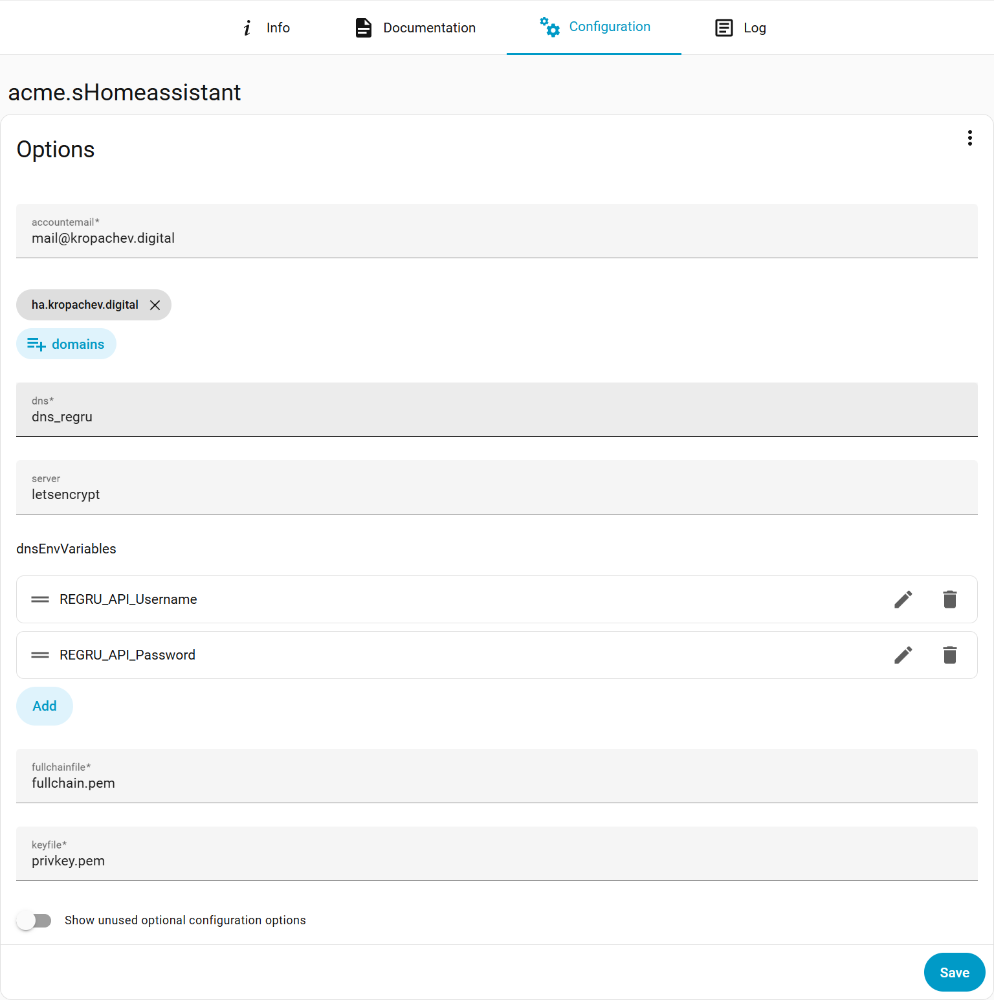

# Бонус. Настройка TLS в Home Assistant

Раз уж установили Home Assistant, расскажу как настроить TLS.  
Из коробки HAOS почему-то не предлагает защищенное соединения (видимо название операционной системы определило ее развитие), оставляя нас с голым HTTP.  

Для настройи HTTPS нам понадобится:
- доменное имя (в инструкции рассмотрен вариант с регистраторм reg.ru)
- официальный плагин NGINX
- неофициальный плагин acme.sh
- приложение для редактирования файлов home assistant

## Настройка доступа по доменному имени

Сертификат будет выдаваться под доменное имя. Соответственно обращаться к сервису мы тоже должны по доменному имени. Для доступа к сервисам внутри сети по имени необходимо выполнить настройки на роутере.

В OpenWRT это делается в настройках **Network** - **DHCP and DNS**  
В поле Addresses нужно указать соответствие Адреса и IP.  
Пример для IPv4 и IPv6:
```
/ha.kropachev.digital/192.168.1.50
/ha.kropachev.digital/::ffff:192.168.1.50
```
Чтобы эти настройки применились нужно перезапустить роутер.

## Настройка API Reg.ru

Если это первый опыт получения сертификата через апи reg.ru, то необходимо выполнить некоторые настройки в личном кабинете.  

В личном кабинете reg.ru вверху-справа нужно кликнуть по названию своего аккаунта и выбрать `Настройки`.  
В списке выбираем `Настройки API`.  
Нам нужно указать `Альтернативный пароль` и `Диапазоны IP-адресов` - IP, с которых будет разрешено использовать апи.

## Плагин acme.sh и получение сертификата.

К сожалению официальный плагин Let's Encrypt не позволяет получить сертификат reg.ru через DNS challenge.  
Мы установим плагин с acme.sh, в котором есть скрипты для большинства провайдеров.  
Плагин не доступен в официальном репозитории, нам нужно добавить репозиторий разработчика.

**Settings** - **Apps**  
Внизу-справа жмем синюю кнопку Install app. Откроется магазин приложений и теперь вверху-справа нужно нажать три точки и выбрать `Repositories`.  
В поле дря адреса указываем `https://codeberg.org/hupf/homeassistant-addons` и жмем Add.

Отлично. Теперь в списке приложений у нас появилось `acme.sHomeassistant`. Выбираем его и устанавливаем.

Для начала переходим во вкладу `Configuration`.  
Здесь нам потребуется заполнить несколько полей
- **accountemail**: ваш имейл
- **domains**: добавить домен, на который будет выдан сертификат.
- **dms**: dns провайдер, у меня это reg.ru
- **server**: letsencrypt - центр сертификации
- **dnsEnvVariables**: нужно указать переменные api dns провайдера. У reg.ru это две переменных `REGRU_API_Username` и `REGRU_API_Password`, логин и пароль, как можно понять.

<details>
<summary>Пример заполнения Configuration</summary>



</details>

Жмем кнопку `Save`.  

Теперь переходим во вкладку `Info`.

Включаем переключатели `Start on boot` и `Watchdog`, нажимаем `Start`.

Результат работы можно посмотреть на вкладке `Log`.  
Ищите строки:
```bash
Installing key to: /ssl/ha.kropachev.digital/privkey.pem
Installing full chain to: /ssl/ha.kropachev.digital/fullchain.pem
```
Обратите внимание, сертификаты складываются в подпапку домена.

## Плагин NGINX

Здесь все гораздо проще. Плагин официальный и доступен в стандартном магазине.

**Settings** - **Apps**  
Опять нажимаем `Install app` и выбираем `NGINX Home Assistant SSL proxy`.  
Идем во вкладу `Configuration`.  
Здесь нам нужно только указать доменное имя и правильный путь к сертификатам. По умолчанию плагин ищет сертификаты в папке /ssl, нам нужно будет добавить доменное имя перед именем сертификата.
Пример:
```
ha.kropachev.digital/fullchain.pem
ha.kropachev.digital/privkey.pem
```
Сохраняем изменения и переходим во вкладку Info.
Включаем переключатели `Start on boot` и `Watchdog` и нажимаем `Start`.

## Настройка разрешения для прокси

Разработчики Home Assistant настолько суровые, что не позволяют прокси в официальных просто плагинах просто работать. Включить возможность использования прокси в настройках интерфейса тоже нельзя. Это официальная позиция описанная в документации.

Чтобы разрешить использовать прокси нужно отредактировать системные файлы. Но просто так это тоже нельзя сделать. Нужно установить приложение для редактирования файлов (я понимаю как это звучит, но повторюсь - это позиция разработчиков описанная в документации).

**Settings** - **Apps**   
Нажимаем `Install app` и выбираем `File editor`.  

На закладке `Info` включаем переключатель `Show in sidebar` и нажимаем `Start`.  
Приложение запускается долго, придется потерпеть.

После запуске в левой панели появится новый раздел - `File editor`. Переходим в этот раздел и теперь вверху нужно нажать на большую иконку с папкой, для просмотра файловой системы.

Нас будет интересовать файл `configuration.yaml`, выбираем его и в правой части окна откроется содержимое файла.  
В конец файла нам нужно добавить раздел `http` с настройками для разрешения перенаправления вызовов от прокси и адресов поркси, которым будет доверять Home Assistant.  
В данном случае `172.30.33.0/24` это внутренняя сесть Home Assistant, т.е. доверенными будут считаться все прокси установленные внутри самого Home Assistant.

```yaml
http:
  use_x_forwarded_for: true
  trusted_proxies:
    - 172.30.33.0/24  # You may also provide the subnet mask
```

После сохранения файлов, нужно перезагрузить машину с Home Assistant.

## Настройка разрешения для прокси

Вот и все. Простая задача растянулась на множество действий.

Зато теперь мы можем обращаться к серверу внутри сети по доменному имени с использованием защищенного соединения.