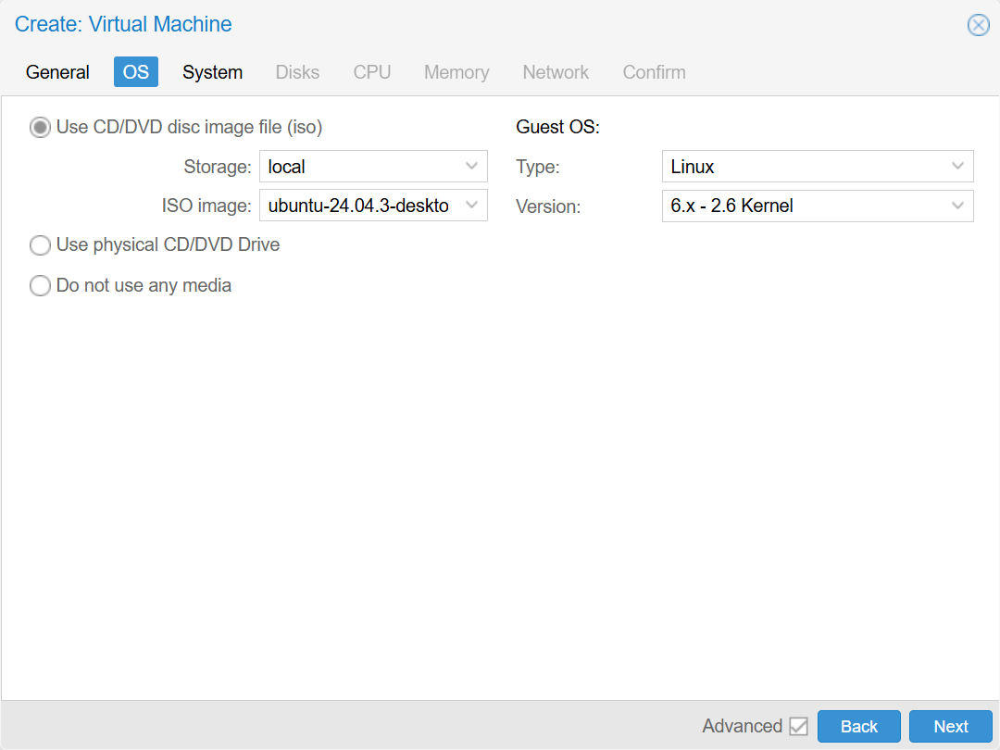
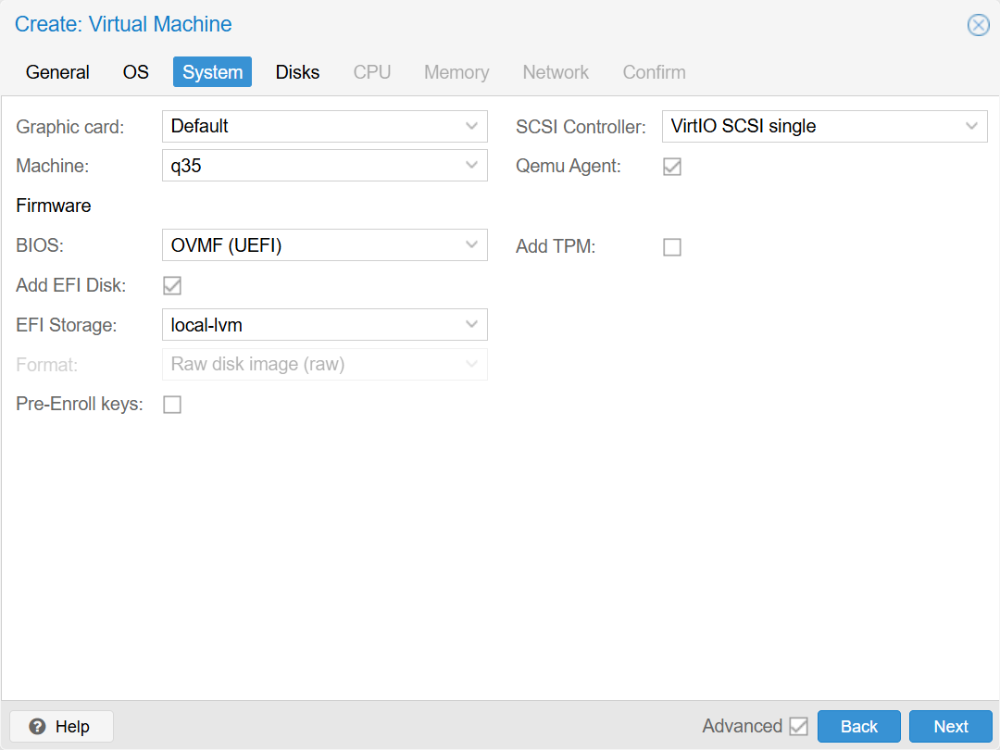
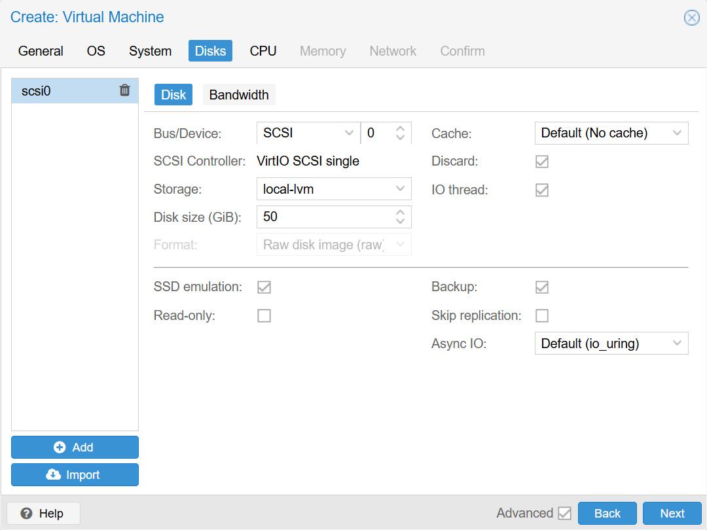
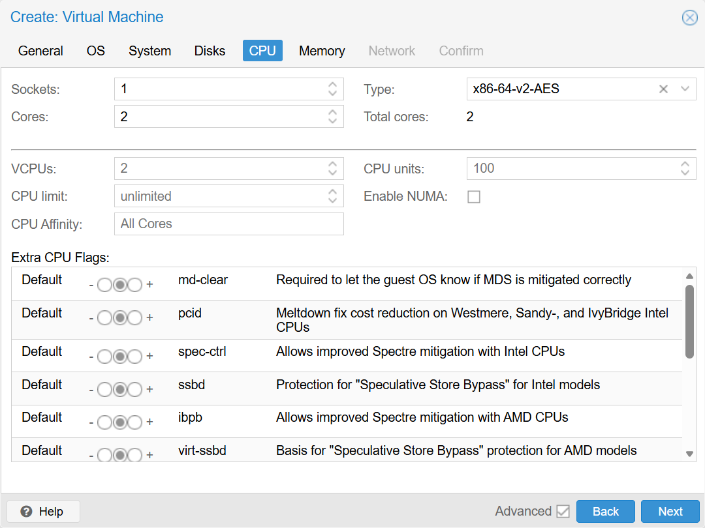
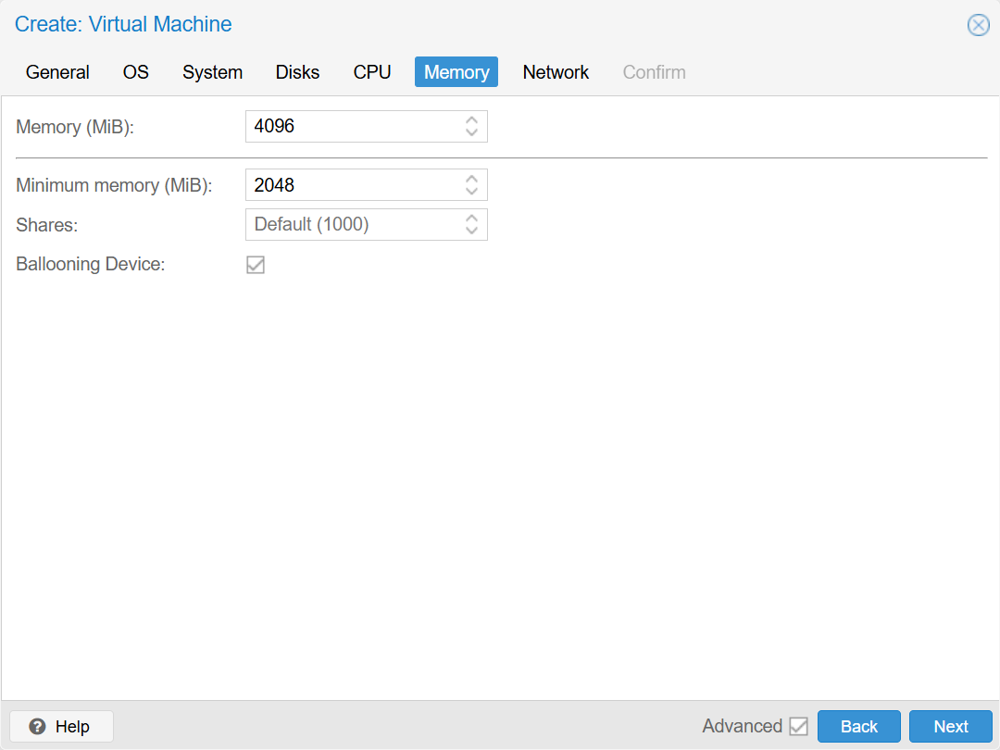

# Создание виртуальной машины Linux в Proxmox VE 9

Описание пошагового процесса создания виртуальной машины с Linux в Proxmox.  
Инструкция рассчитана на начинающих пользователей и охватывает базовые этапы - от подготовки установочного ISO-образа до настройки драйверов и гостевого агента.

## Подготовка

**ISO образ**. Для создания виртуальной машины необходим образ. В инструкции будет использоваться дистрибутив Ubuntu, кльлоый доступен на сайте https://ubuntu.com/.

## Загрузка образов в Proxmox

**Шаг 1. Загрузка ISO образа ОС.** Чтобы установить ОС в виртуальную машину, нужен установочный ISO-файл этой ОС (например, образ Ubuntu Server или Windows). Скачайте нужный ISO на ваш компьютер, затем **загрузите его в хранилище Proxmox**. В веб-интерфейсе перейдите в **Storage (например, local) - Content** и нажмите кнопку **Upload**. Выберите файл ISO со своего ПК – начнется загрузка на сервер. По окончании ISO появится в списке Content хранилища. Убедитесь, что ISO образ доступен.

## Создание новой виртуальной машины

Нажмите **Create VM** (вверху-справа).  
Откроется окно создания новой виртуальной машины. Для навигации по закладкам можно использовать команды Back, Next.
1. **General**, Первая закладка 
   1. **Node:** имя севрера. Сервер скорее всего один, заполнится автоматически.
   2. **VM ID:** уникальный идентификатор. Можно не менять.
   3. **Name:** имя - произвольное, например `Ubuntu`.
   4. **Start at boot:** запускать виртуальную машину при старте сервера Proxmox. Я обычно включаю.
   5. **Tags:** если виртуальных машин много, то удобно отбирать их по тегам, например `win`, `ubuntu`, `prod`, `test`.  
   Остальные поля не трогаем.
   <details>
   <summary>Пример настроек General</summary>
   
      
   
   </details>

   Next.

1. **OS**  
Мы загрузили образ в локальное хранилище, поэтому выбираем **Use CD/DVD disc image file (iso)**  
   1. **Storage:** local.
   2. **ISO image:** из списка нужно выбрать образ с операционной системой.
   3. **Type:** Linux.
   4. **Version:** оставляем по умолчанию (6.x - 2.6 Kernel).

   <details>
   <summary>Пример настроек OS</summary>
   
      
   
   </details>

   Next

1. **System**  
   1. **Machine:** q35 для современных операционных систем и при выборе OVMF (UEFI) в BIOS. Для совместимости со старыми операционками можно выбирать i440fx.
   2. **BIOS:** OVMF (UEFI). Современный вариант, его и стоит ставить для свежих операционных систем.
   3. **Add EFI Disk:** Включаем при выборе OVMF (UEFI), для хранения настроек UEFI.
   4. **EFI Storage:** Выбираем доступное хранилище для UEFI.
   5. **Pre-enroll keys:** Выключаем, не релевантно для Linux.
   6. **Qemu Agent:** Включаем.
   <details>
   <summary>Пример настроек System</summary>
   
      
   
   </details>

   Next

2. **Disks:**  
   1. **Disk size (GiB):**  нужно опираться на системные требования дистрибутивов. Ubuntu Server (без графической оболочки) требует минимум 5 GB, Ubuntu Desktop требует уже 25 GB.
   2. **Cache:** `Default (No cache)` безопасно но медленнее, `Write back` быстрее но при потере питания данные могут быьт потеряны. Выбирайте в зависимости от потребности.
   3. **Discard:** включить, на хосте не будет резервироваться весь объем выделенного пространства.  
   Остальные поля не меняем.
   3. ***SSD emulation:** включить, если действительно используется SSD.
   
   <details>
   <summary>Пример настроек Disks</summary>
   
      
   
   </details>

   Next

3. **CPU:** 
   1. **Cores:** Минимум 2 ядра.  
Остальное не меняем.  
   <details>
   <summary>Пример настроек CPU</summary>
   
      
   
   </details>

   Next

1. **Memory:**
    1. **Memory (MiB):** В системных требованиях Ubuntu указано минимум 2048 при установке на виртуальную машину (4096 для остальных случаев).  
    2. **Minimum memory (MiB):** Минимальный размер зарезервированной памяти. Все что выше этого значения может освобождаться хостом для других виртуальных машин.  
    3. **balooning Device:** разрешить забирать у виртуальной машины неиспользуемую память и отдавать ее обратно, когда она нужна. Работает в диапазоне есть **Memory** и **Minimum memory**.  
   <details>
   <summary>Пример настроек Memory</summary>
   
      
   
   </details>

   Next

2.  **Network**  
Ничего не меняем.  
Nest

1.  **Confirm**  
Можно проверить список настроек и убедиться в корректности перед завершением работы с мастером.  
Нужно снять галку галочку `Start after created`.  
Finish

В списке виртуальных машин появилась новая запись с указанными при создании ID и именем.  
Теперь можно запускать виртуальную машину и приступать к установке операционной системы.

## Установка Ubuntu 

Убунту доступна в версиях Server и Desktop. У версии Server отсутствует графический интерфей, поэтому мы рассматриваем оба вариант установки.

1. Выбираем нашу виртуальную машину в списке и справа жмем кнопку `Start` (или через контекстное меню кликнув правой клавишей мыши по виртуальной машине).
2. Переходим в  `>_ Console` и видим стандартный установщик Ubuntu.

### Установка Ubuntu Desktop

1. Выбираем язык (English).
2. Accessibility - ничего не меняем, жмем Next.
3. Конфигурация клавиатуры - не меняем (English (US)).
4. Настройка сетевого соединения - выбрать вариант подключения к сети.
5. Update available - обновление мастера установки - по своему усмотрению. Я пропускаю.
6. Настройки жесткого диска - убираем галку Setup this disk as an LVM group.
7. Try or Install - ну и наконец выбираем Install Ubuntu и жмем Next.
8. Type of installation - Выбираем Interactive instalation, мы ведь новички.
9. Applications - Default selection (лишнего нам не нужно).
10. Optimize - your computer - не выбираем ничего.
11. Disk setup - оставляем по умолчанию, Erase disk and install Ubuntu.
12. На экране установок профиля указываем пользователя и пароль (administrator, например). Имя компьютера рекомендую указать то же, что и имя указанное в Proxmox.
13. Часовой появс - свой.
14. Ready to install - убеждаемся в корректности настроек и жмем Install.
15. Наблюдаем за процессом установки. По завершению мастер установки предложит перезагрузиться - жмем **Restart now**.

Если после установки появляется окно с просьбой `Please remove the installation media, then press Enter`, то переходим на закладку Hardware, для раза кликаем по CD/DVD Drive, устанавливаем переключатель `Do not use any media` и жмем OK. Возвращаемся в закладку >_Concole и жмем Enter - Загрузка операционной системы продолжится.

### Установка Ubuntu Server

1. Выбираем язык (English).
2. Настройка клавиантуры - ничего не меняем, оставляем English.
3. Вариант установки - оставляем Ubuntu Server.
4. Настройка сетевого соединения - не меняем.
5. Прокси - пропускаем.
6. Настройка адресов зеркал - не меняем.
7. Настройки жесткого диска - убираем галку `Setup this disk as an LVM group`.
8. Разметка диска - не меняем. Подтверждаем настройки.
9. На экране установок профиля указываем пользователя и пароль (administrator, например). Имя компьютера рекомендую указать то же, что и имя указанное в Proxmox.
10. Ubuntu Pro - не ставим, конечно.
11. Установка SSH - ставим галку Install OpenSSH server.
12. На экране со списком рекомендуемых для установки пакетов не выбираем ничего.
13. Начнется процесс установки. После завершения установки система предложит выполнить логин.

Если после установки появляется окно с просьбой `Please remove the installation media, then press Enter`, то переходим на закладку Hardware, для раза кликаем по CD/DVD Drive, устанавливаем переключатель `Do not use any media` и жмем OK. Возвращаемся в закладку >_Concole и жмем Enter - Загрузка операционной системы продолжится.

## Установка QEMU Guest Agent

Если установка проходит в Ubuntu desktop, то нужно открыть терминал.  
Если установлен Ubuntu Serve - мы уже в терминале.

Обновляем пакеты
```bash
sudo apt update
```
```bash
sudo apt upgrade
```

Устанавливаем агент
```bash
sudo apt install qemu-guest-agent
```
Запускаем
```bash
sudo systemctl start qemu-guest-agent
```
Добавляем в автозагрузку
```bash
sudo systemctl enable qemu-guest-agent
```

Перезагружаем виртуальную машину.

После этого Proxmox начнет отображать IP-адрес и состояние агента во вкладке **Summary**.

## Заключение

Теперь виртуальная машина с Ubuntu готова к использованию.