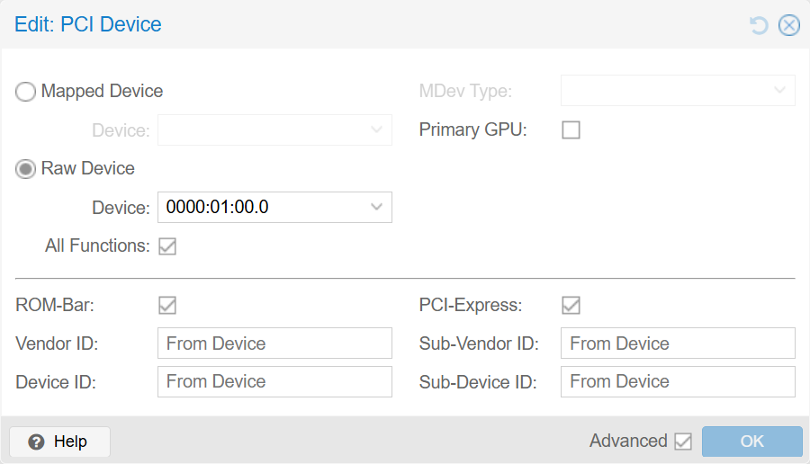

# Создание виртуальной машины для запуска LLM

Создаем виртуальную машину с пробросом видеокарты **NVIDIA RTX 5060** для запуска локальных LLM. Внутри гостевой системы поднимем **Ollama** с **Open WebUI** в Docker и разберемся, какие модели реалистичны на 16 GB VRAM, а где нужен CPU offload.

⚠️ Предполагается, что хост Proxmox уже подготовлен к PCIe Passthrough - IOMMU включен, GPU привязана к `vfio-pci`. Если еще нет - вот ссылка на  [описание Proxmox PCIe Passthrough](proxmox-pcie-passthrough).

В качестве гостевой ОС будем использовать **Ubuntu Server 26.04**. Canonical теперь сама распространяет CUDA в `multiverse`, ставится одним пакетом без подключения внешних репозиториев.

## Создание виртуальной машины

Базово процесс создания машины не отличается от описанного в статье [Создание виртуальной машины Linux](proxmox-creating-linux-vm). Ниже только те закладки и поля, где параметры отличаются от стандартных или на которые следует обратить внимание - все остальное (General, OS, Network) оставляем как в обычной виртуалке.

1. **System**
   - **Machine:** `q35` - **обязательно**.

2. **Disks**
   - **Disk size (GiB):** `200`. Llama ~42 ГБ, плюс 8-32B-модели, плюс место под Open WebUI.
   - **Bus/Device:** `SCSI`, контроллер `VirtIO SCSI single`.
   - **IO thread:** включить - заметно лучше под IO-нагрузку Docker и подгрузку весов моделей.

3. **CPU**
   - **Cores:** `12` (для i7-12700K / i9-12900K). Для i5-12600K можно `8`.
   - **Type:** `host` - **критично!** Без этого внутри гостя не будет AVX2/AVX-512, и Ollama просядет в скорости.
   - **NUMA:** выключено (один сокет).

4. **Memory**
   - **Ballooning Device:** **снять галку** - **обязательно для PCIe passthrough**. GPU работает с памятью через DMA, и QEMU обязан закрепить всю память VM в физической RAM хоста - балунинг этому противоречит. На практике это значит: все, что будет указано в **Memory (MiB)**, заберется у хоста при старте VM и **не вернется** обратно, пока VM работает, даже если внутри она не используется. Поэтому ставим ровно столько, сколько реально нужно под сценарий.
   - **Memory (MiB):** выбираем по сценарию:
     - **16384** (16 ГБ) - если будут запускаться только модели, помещающиеся в 16 ГБ VRAM (24B в Q4). Этого хватит на Ubuntu Server + Docker + процесс Ollama + дисковый кэш при загрузке весов с диска. RAM модели не нужна - она целиком живет в VRAM.
     - **40960** (40 ГБ) - запас под модели 32B с частичным CPU offload или несколько одновременно загруженных моделей.

5. **Confirm**
   - Снимите галку `Start after created` - сначала пробросим GPU и настроим CPU affinity, и только потом стартуем.

## Проброс видеокарты в VM

Выбираем созданную VM в списке слева, переходим в **Hardware → Add → PCI Device**.

1. **Raw Device:** выбираем `0000:01:00` (адрес из `lspci`, тот, что закрепляли за `vfio-pci`).
2. **All Functions:** включаем - захватит и видео `01:00.0`, и HDMI-аудио `01:00.1`.
3. **PCI-Express:** включаем.
4. **Primary GPU:** **не включаем**. Оставляем стандартный дисплей `Default (std)` - это даст рабочий noVNC до загрузки драйвера NVIDIA в гостевой ОС. По перепискам на форумах с RTX 50-series, включение Primary GPU + ROM-Bar иногда мешает загрузке VM.
5. **ROM-Bar:** включаем (по умолчанию). Если VM не стартует - попробуйте снять.

Add.

<details>
<summary>Пример настроек PCI Device</summary>

   

</details>

## CPU affinity для гибридного 12-го поколения

У Intel 12-го поколения (Alder Lake) - есть производительные **P-cores** и энергоэффективные **E-cores**. Хост Proxmox не всегда понимает, на какие ядра ставить vCPU виртуальной машины. Если vCPU попадает на E-core - скорость инференса LLM будет просаживаться.

Лечится **CPU affinity** - явным закреплением vCPU за P-cores.

Сначала смотрим на хосте, какие логические CPU принадлежат P-cores:

```bash
lscpu -e
```

Пример вывода для i7-12700K (8 P-cores с HT + 4 E-cores):

```
CPU NODE SOCKET CORE L1d:L1i:L2:L3 ONLINE    MAXMHZ   MINMHZ       MHZ
  0    0      0    0 0:0:0:0          yes 4800.0000 800.0000 1068.4771
  1    0      0    0 0:0:0:0          yes 4800.0000 800.0000  800.0000
  2    0      0    1 4:4:1:0          yes 4800.0000 800.0000 2432.8269
  3    0      0    1 4:4:1:0          yes 4800.0000 800.0000  800.0000
  4    0      0    2 8:8:2:0          yes 4800.0000 800.0000 2473.8250
  5    0      0    2 8:8:2:0          yes 4800.0000 800.0000  800.0000
  6    0      0    3 12:12:3:0        yes 4800.0000 800.0000 1290.4310
  7    0      0    3 12:12:3:0        yes 4800.0000 800.0000  800.0000
  8    0      0    4 16:16:4:0        yes 4900.0000 800.0000 4156.9790
  9    0      0    4 16:16:4:0        yes 4900.0000 800.0000  800.0000
 10    0      0    5 20:20:5:0        yes 4800.0000 800.0000  978.8470
 11    0      0    5 20:20:5:0        yes 4800.0000 800.0000  800.0000
 12    0      0    6 24:24:6:0        yes 4900.0000 800.0000  800.0000
 13    0      0    6 24:24:6:0        yes 4900.0000 800.0000  800.0000
 14    0      0    7 28:28:7:0        yes 4800.0000 800.0000 2374.3921
 15    0      0    7 28:28:7:0        yes 4800.0000 800.0000  800.0000
 16    0      0    8 36:36:9:0        yes 3600.0000 800.0000 3599.9600
 17    0      0    9 37:37:9:0        yes 3600.0000 800.0000 2900.1880
 18    0      0   10 38:38:9:0        yes 3600.0000 800.0000  800.0000
 19    0      0   11 39:39:9:0        yes 3600.0000 800.0000 2082.8030
```

CPU 0-15 - это P-cores (8 ядер × 2 потока), CPU 16-19 - E-cores. Нам нужны первые 16.

Открываем конфиг VM через SSH (`301.conf` это ид виртуальной машины, указывайте ваш номер):

```bash
nano /etc/pve/qemu-server/301.conf
```

Добавляем строку:

```
affinity: 0-15
```

Для i9-12900K (8P + 8E) диапазон будет `0-15`. Для i5-12600K (6P + 4E) - `0-11`. Всегда сверяйтесь с реальным выводом `lscpu -e`.

## Итоговый конфиг VM

После всех правок `/etc/pve/qemu-server/301.conf` выглядит примерно так:

```ini
agent: 1
balloon: 0
bios: ovmf
boot: order=scsi0;ide2;net0
cores: 12
affinity: 0-15
cpu: host
efidisk0: local-lvm:vm-301-disk-0,efitype=4m,size=4M
ide2: local:iso/ubuntu-26.04-live-server-amd64.iso,media=cdrom,size=2850194K
machine: q35
memory: 16384
meta: creation-qemu=10.1.2,ctime=1779915032
name: llm
net0: virtio=BC:24:11:B5:BF:1C,bridge=vmbr0,firewall=1
numa: 0
onboot: 1
ostype: l26
scsi0: local-lvm:vm-301-disk-1,discard=on,iothread=1,size=200G,ssd=1
scsihw: virtio-scsi-single
smbios1: uuid=139a98f4-81c8-4e86-9463-3a73736236ec
sockets: 1
tags: docker;linux;llm
vmgenid: ea0d1bfa-fac8-4948-ac1e-43065cf9e4f2
```

Можно стартовать VM.

## Установка Ubuntu Server 26.04

Процесс установки системы стандартный. Здесь только акценты:

* Сетевые настройки - предпочтительно статический IP, чтобы Open WebUI был по постоянному адресу.
* Жесткий диск - **убираем галку** `Setup this disk as an LVM group` (как и для обычной VM).
* **Install OpenSSH server** - обязательно, дальше все делаем по SSH.
* Дополнительные snap'ы - не выбираем ничего.

## Установка QEMU Guest Agent

Подключаемся к VM по SSH и ставим агент:

```bash
sudo apt update && sudo apt upgrade -y
sudo apt install qemu-guest-agent -y
sudo systemctl enable --now qemu-guest-agent
```

После перезагрузки Proxmox начнет показывать IP и состояние агента во вкладке **Summary**.

## Установка драйверов NVIDIA для Blackwell

Ubuntu 26.04 - первый релиз, где Canonical в партнерстве с NVIDIA сама распространяет CUDA через `apt`. Драйвер и тулкит ставятся одной командой:

```bash
sudo apt install nvidia-driver-595-open nvidia-cuda-toolkit -y
sudo reboot
```

Получаем драйвер 595.71.05 и CUDA 13.x - этого достаточно для Ollama, llama.cpp и большинства задач.

### Проверка

```bash
nvidia-smi
```

Должна показать `NVIDIA GeForce RTX 5060`, версия драйвера 595+ и CUDA 13.x. Если видим - первая часть пройдена.

## Установка Docker + NVIDIA Container Toolkit

Open WebUI и другие LLM-инструменты удобнее запускать в Docker. Чтобы контейнеры имели доступ к GPU, понадобится **NVIDIA Container Toolkit**.

Напоминаю ссылку на официальную инструкцию установки docker - https://docs.docker.com/engine/install/ubuntu/  

### Добавляем репозиторий Docker

```bash
# Add Docker's official GPG key:
sudo apt update
sudo apt install ca-certificates curl
sudo install -m 0755 -d /etc/apt/keyrings
sudo curl -fsSL https://download.docker.com/linux/ubuntu/gpg -o /etc/apt/keyrings/docker.asc
sudo chmod a+r /etc/apt/keyrings/docker.asc

# Add the repository to Apt sources:
sudo tee /etc/apt/sources.list.d/docker.sources <<EOF
Types: deb
URIs: https://download.docker.com/linux/ubuntu
Suites: $(. /etc/os-release && echo "${UBUNTU_CODENAME:-$VERSION_CODENAME}")
Components: stable
Architectures: $(dpkg --print-architecture)
Signed-By: /etc/apt/keyrings/docker.asc
EOF

sudo apt update
```

### Устанавливаем Docker Engine и плагин Compose

```bash
sudo apt install docker-ce docker-ce-cli containerd.io docker-buildx-plugin docker-compose-plugin
```

### Постустановка: группа docker и автозапуск

```bash
sudo groupadd docker
```
```bash
sudo usermod -aG docker $USER
```
```bash
newgrp docker
```
```bash
sudo systemctl enable docker.service
sudo systemctl enable containerd.service
```

### Добавляем репозиторий NVIDIA Container Toolkit и устанавливаем

Ссылка на инструкцию - https://docs.nvidia.com/datacenter/cloud-native/container-toolkit/latest/install-guide.html

> В официальноу документации NVIDIA используется apt-get, здесь во всех командах заменено на apt.

Добавляем необходимые компоненты
```bash
sudo apt update && sudo apt install -y --no-install-recommends \
   ca-certificates \
   curl \
   gnupg2
```

Добавляем репозиторий
```bash
curl -fsSL https://nvidia.github.io/libnvidia-container/gpgkey | sudo gpg --dearmor -o /usr/share/keyrings/nvidia-container-toolkit-keyring.gpg \
  && curl -s -L https://nvidia.github.io/libnvidia-container/stable/deb/nvidia-container-toolkit.list | \
    sed 's#deb https://#deb [signed-by=/usr/share/keyrings/nvidia-container-toolkit-keyring.gpg] https://#g' | \
    sudo tee /etc/apt/sources.list.d/nvidia-container-toolkit.list
```

Обновляем пакеты
```bash
sudo apt update
```

И устанавливаем Toolkit  
В команде указана версия `1.19.1-1` последняя на момент создания статьи. Номера актуальной версии можно посмотреть по ссылке выше.
```bash
export NVIDIA_CONTAINER_TOOLKIT_VERSION=1.19.1-1
  sudo apt install -y \
      nvidia-container-toolkit=${NVIDIA_CONTAINER_TOOLKIT_VERSION} \
      nvidia-container-toolkit-base=${NVIDIA_CONTAINER_TOOLKIT_VERSION} \
      libnvidia-container-tools=${NVIDIA_CONTAINER_TOOLKIT_VERSION} \
      libnvidia-container1=${NVIDIA_CONTAINER_TOOLKIT_VERSION}
```

Финальные настройи
```bash
sudo nvidia-ctk runtime configure --runtime=docker
```

И перезапуск докера
```bash
sudo systemctl restart docker
```

Проверка - запускаем `nvidia-smi` внутри контейнера:

```bash
sudo docker run --rm --runtime=nvidia --gpus all ubuntu nvidia-smi
```

Если внутри контейнера видим RTX 5060 - GPU доступна для Docker.

## Устанавливаем Ollama

Ollama - самый простой способ использовать LLM локально. 

```bash
curl -fsSL https://ollama.com/install.sh | sh
```

Установщик автоматически зарегистрирует systemd-сервис и подхватит GPU. Проверяем:

```bash
ollama run llama3.1:8b
```

При первом запуске модель скачается (~5 ГБ). Параллельно в другом терминале можно посмотреть утилизацию GPU:

```bash
nvidia-smi dmon -s pucvmet
```

Если столбец `sm` (использование вычислителей) поднимается во время генерации - все работает.

## Устанавливаем Open WebUI

Open WebUI - удобный веб-интерфейс к Ollama (похож на ChatGPT). Поднимаем через docker compose, а доступ снаружи сделаем по HTTPS через Caddy на отдельном поддомене `llm.kropachev.digital`. Ollama при этом остается слушать `localhost:11434` без TLS - это внутренняя связь между процессами на одной VM. Caddy будем использовать из-за простоты настройки, в nginx пришлось бы certbot настраивать.

### DNS-имя для VM

Так же, как для веб-интерфейса Proxmox в статье [Настройка TLS](proxmox-tls), указываем соответствие в OpenWRT (**Network → DHCP and DNS**, поле Addresses):

```
/llm.kropachev.digital/192.168.1.50
/llm.kropachev.digital/::ffff:192.168.1.50
```

IP подставьте свой (тот, что задали статикой при установке Ubuntu). Перезапустите роутер, чтобы dnsmasq подхватил изменения.

### Сертификат Let's Encrypt через acme.sh

Учетные данные REG.RU API уже подготовлены по статье [Настройка TLS](proxmox-tls) - используем их же. Ставим acme.sh внутри VM и выпускаем сертификат через DNS-01 challenge.  
Экспортируем переменные
```bash
export ACME_EMAIL='you@example.com'
export REGRU_API_Username='your_login'
export REGRU_API_Password='your_api_password'
```
И выполняем установку и запуск (таймаут 300 секунд)
```bash
sudo apt install socat -y
curl -fsSL https://get.acme.sh | sh -s email=$ACME_EMAIL

# По умолчанию acme.sh использует ZeroSSL - переключаемся на Let's Encrypt
~/.acme.sh/acme.sh --set-default-ca --server letsencrypt

~/.acme.sh/acme.sh --issue --dns dns_regru --dnssleep 300 -d llm.kropachev.digital

sudo mkdir -p /etc/ssl/llm
sudo chown $USER:$USER /etc/ssl/llm

~/.acme.sh/acme.sh --install-cert -d llm.kropachev.digital \
  --key-file       /etc/ssl/llm/privkey.pem \
  --fullchain-file /etc/ssl/llm/fullchain.pem \
  --reloadcmd      "docker restart caddy"
```

`acme.sh` сам поставит cron-задание на автообновление.

### docker compose и Caddyfile

Создаем каталог проекта:

```bash
mkdir -p ~/open-webui && cd ~/open-webui
```

Создаем `docker-compose.yml`:

```bash
nano docker-compose.yml
```

```yaml
services:
  open-webui:
    image: ghcr.io/open-webui/open-webui:main
    container_name: open-webui
    restart: unless-stopped
    network_mode: host
    environment:
      - OLLAMA_BASE_URL=http://localhost:11434
    volumes:
      - ./data:/app/backend/data

  caddy:
    image: caddy:2-alpine
    container_name: caddy
    restart: unless-stopped
    network_mode: host
    volumes:
      - ./Caddyfile:/etc/caddy/Caddyfile:ro
      - /etc/ssl/llm:/etc/ssl/llm:ro
      - caddy_data:/data
      - caddy_config:/config

volumes:
  caddy_data:
  caddy_config:
```

`network_mode: host` для обоих контейнеров - простейший вариант: Open WebUI слушает `:8080`, Caddy - `:443`, конфликтов нет. Open WebUI достучится до Ollama по `localhost:11434`.

Создаем `Caddyfile`:

```bash
nano Caddyfile
```

```
llm.kropachev.digital {
    tls /etc/ssl/llm/fullchain.pem /etc/ssl/llm/privkey.pem
    reverse_proxy localhost:8080
}
```

Запускаем:

```bash
docker compose up -d
```

Открываем в браузере `https://llm.kropachev.digital`, создаем первого пользователя (он автоматически становится администратором), выбираем модель из выпадающего списка - готово.

## Какие модели можно попробовать на 16 GB VRAM

На RTX 5060 16 GB полностью в VRAM комфортно работают модели до **~24B параметров** с квантованием Q4-Q5.

| Модель | Квант | VRAM | Применение |
|---|---|---|---|
| Llama 3.1 8B | Q4_K_M | ~5 ГБ | Быстрый чат, простые агенты, классификация текста, саммаризация коротких документов |
| Qwen 3.5 9B | Q5_K_M | ~7 ГБ | Универсальный чат, умеет рассуждать (thinking) |
| Llama 3.1 8B | Q8_0 | ~9 ГБ | Те же задачи что Q4, но точнее: переводы, важные тексты, меньше галлюцинаций |
| gpt-oss 20B | Q4_K_M | ~12 ГБ | Агенты с tool calling, многошаговые задачи, ассистент общего назначения. Хорошо себя показал, жаль не умеет работать с изображениями. |
| **Mistral Small 3.2 24B** | **Q4_K_M** | **~13 ГБ** | **Основной рабочий чат: длинные тексты, многоязычные задачи, RAG, следование сложным инструкциям** |
| Qwen 3 Coder 30B (MoE) | Q4_K_M | ~15 ГБ | Генерация и рефакторинг кода, автодополнение в IDE, разбор больших файлов проекта |
| Gemma 4 26B | Q4_K_M | ~15 ГБ | Длинные документы (большой контекст), суммаризация, tool calling - впритык под 16 ГБ |

Команды Ollama:

```bash
ollama pull llama3.1:8b
ollama pull qwen3.5:9b
ollama pull gpt-oss:20b
ollama pull mistral-small3.2:24b
ollama pull qwen3-coder:30b
ollama pull gemma4:26b
```

CPU offload пока не рассматривается. Нужно много оперативной памяти без балунинга, а это мешает работе хоста над другими задачами и посути монополизирует машину под LLM.

## Реальные показатели скорости

Для теста я попросил **qwen3** и **gemma4** написать скрипты для проведения замеров.  

Поделюсь впечатлением, как мы общались для подготовки скрипта.
Обе модели сначала написали скрипт на пайтоне.
На вопрос нужно ли для проведения замеров устанавливать пайтон на машине, qwen3 ответила что нужно и сразу написала команды для установки. А вот gemma4 оказалось более человечной моделью - смекнула что можно и баш скрипт использовать. И это именно gemma4 предложила использовать хоку для сложного теста.  

По реализации тоже были расхождения:
* **gemma4** выбрала обращение к Ollama API `/api/generate` с `stream: false`, чтение полей `eval_count` (количество сгенерированных токенов) и `total_duration` (длительность в наносекундах). Но в скрипте опечатка: `total_duration` делится на триллион вместо миллиарда - из-за чего цифры в логе выглядят абсурдно (десятки тысяч токенов в секунду). После домножения на 1000 данные становятся корректными. Архитектурно лучше, но не очень внимательно с вычислениями.
* **qwen3-coder** пошла проще - запуск `ollama run` через subprocess, замер времени через `date +%s.%N`, подсчет "токенов" через `wc -w` (на самом деле слова). Скрипт работает без багов, но скорость занижена, потому что в русском тексте токенов больше, чем слов. Решение получилось кустарное.

Ниже привожу результаты тестирования.

| Модель | Скорость | Качество ответов на тестах | Комментарий |
|---|---|---|---|
| gpt-oss:latest | **~87 ток/с** | ✅ Все 4 теста корректно | Самая быстрая. Короткий thinking, точные ответы - лучший баланс |
| llama3.1:8b | **~67 ток/с** | ❌ Логика: ответила "суббота" вместо пятницы. ❌ Математика: получила 20 вместо 30 | Без thinking путается даже в простых задачах - годится только под легкие сценарии |
| qwen3.5:9b | **~62 ток/с** | ✅ Логика и математика корректно. ⚠️ Хокку: сорвалась в бесконечный цикл, сгенерировала 2797 токенов повторяющейся фразы | Риск зацикливания на творческих задачах |
| qwen3-coder:30b | **~35 ток/с** | ✅ Логика и математика корректно. ⚠️ Хокку: в текст попали китайские иероглифы (`编程`) | Лаконичные ответы без thinking, сильна в коде |
| gemma4:26b | **~24 ток/с** | ✅ Все 4 теста корректно | Подробный thinking сильно раздувает ответы |
| mistral-small3.2:24b | **~23 ток/с** | ✅ Все 4 теста корректно | Самая медленная из протестированных, но качество стабильно высокое |

Несколько наблюдений по итогам:

* На 16 GB VRAM комфортно живут модели по 24–30B параметров в Q4 - VRAM не упирается.
* MoE-модели (gpt-oss, qwen3-coder) с теми же общими параметрами заметно быстрее dense-моделей сравнимого размера - gpt-oss 20B обгоняет даже llama3.1 8B по чистой скорости.
* Модели с thinking (gemma4, qwen3.5, gpt-oss) тратят значительную часть токенов на внутреннее рассуждение. Реальная "полезная" скорость для пользователя ниже, чем формальные ток/с.
* Универсальный выбор по соотношению скорость/качество - **gpt-oss**. Под код - **gemma4**. Под длинные тексты, многоязычие и требовательные задачи - **mistral-small3.2**.
