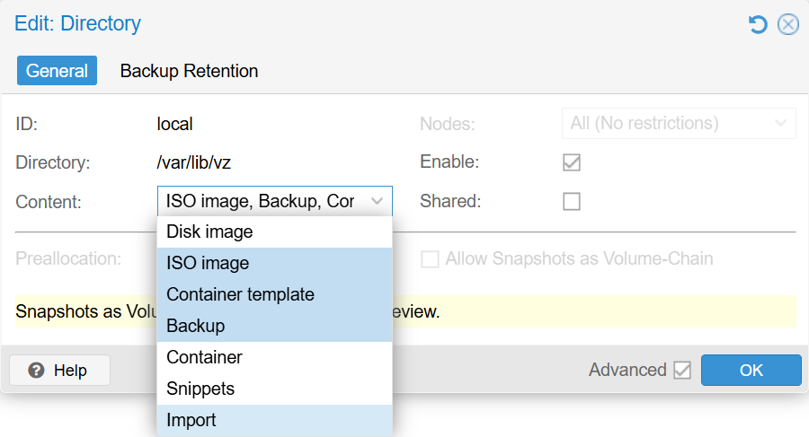
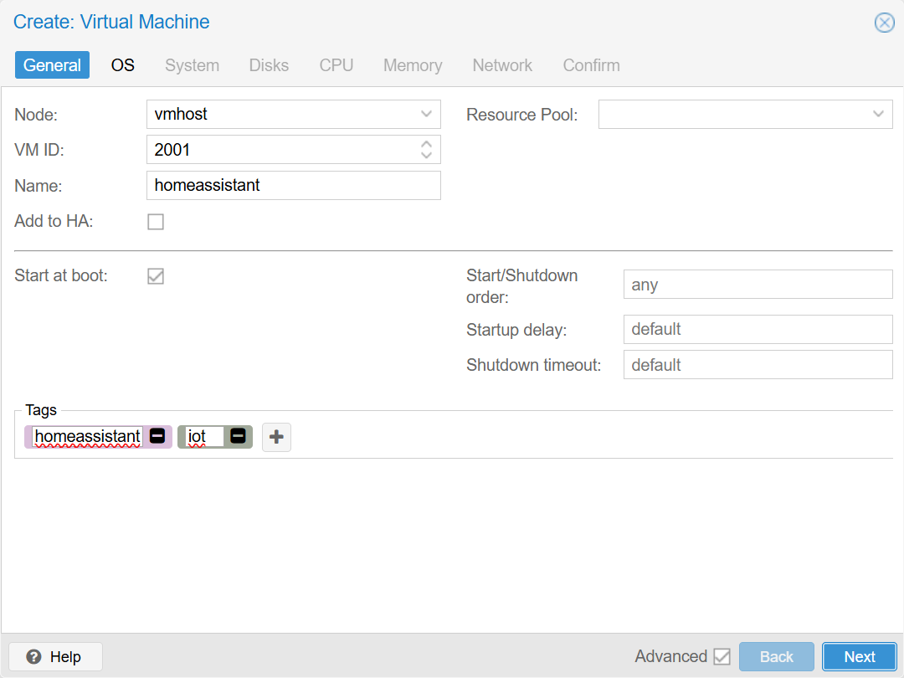
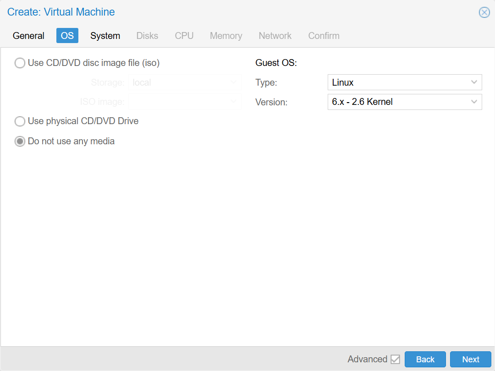
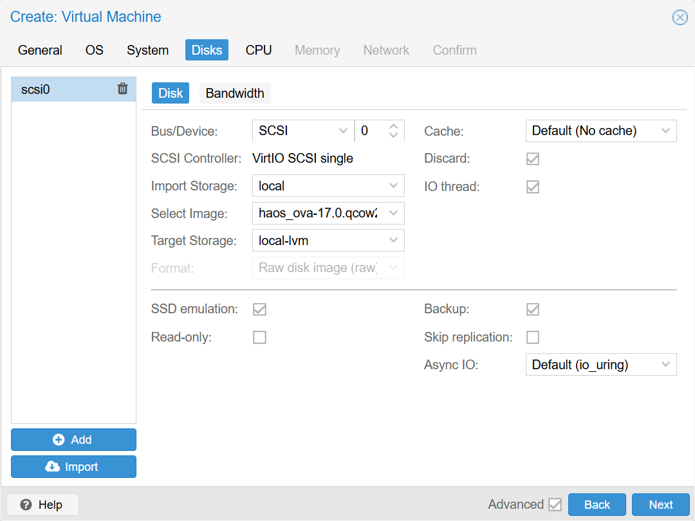
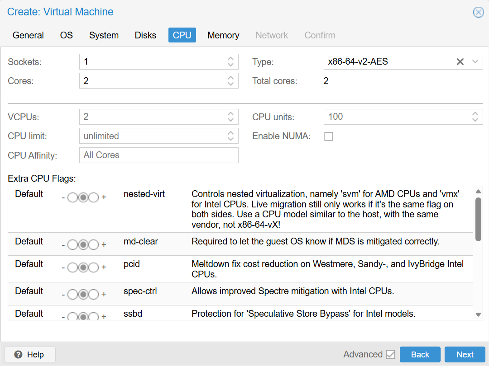
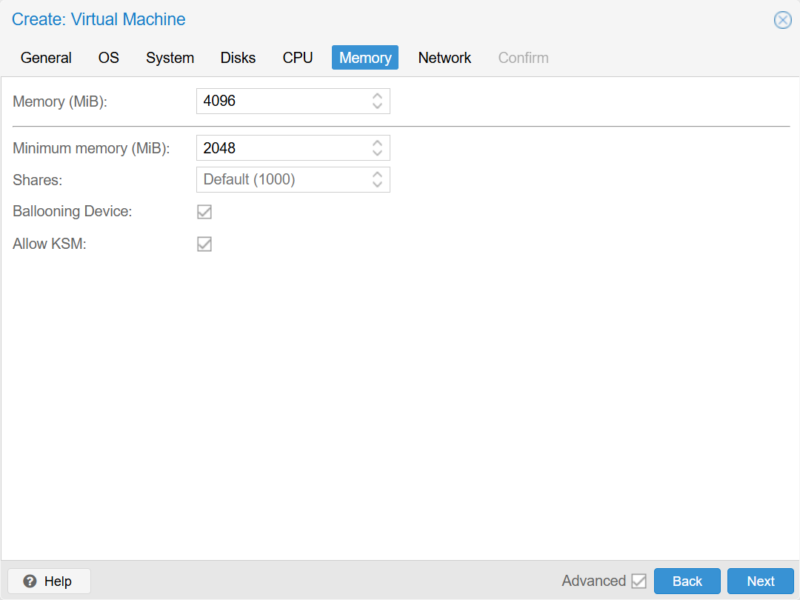

# Создание виртуальной машины из qcow2-образа в Proxmox VE 9 (на примере Home Assistant OS)

Описание пошагового процесса создания виртуальной машины из qcow2-образа в Proxmox.
Инструкция рассчитана на начинающих пользователей и охватывает базовые этапы - от загрузки qcow2-образа и импорта диска до первого запуска Home Assistant.

## Подготовка

Мы будем создавать виртуальную машину из готового образа. Актуальные образы публикуются в документации Home Assistant - https://www.home-assistant.io/installation/alternative/.  
Нам нужен `KVM/Proxmox (.qcow2)`.

## Загрузка образов в Proxmox

Здесь была отличная возможность рассмотреть прямое скачивание образа по ссылке прямо в Proxmox, но разработчики Home Assistant хотят чтобы мир горел, поэтому распространяют образы в сжатом виде. Нам нужно скачать нужный, разархивировть и только потом загрузить в Proxmox.  
Итак, скачиваем, разархивируем.  
В веб-интерфейсе перейдите в **Storage (например, local) - Import**.  
> Здесь мы можем столкнуться с тем, что раздел **Import** отсутствует. Это легко решается настройками - **Datacenter** - **Storege**, выбираем **local** и нажимем кнопку **edit**. Здесь нужно раскрыть раздел Content и кликнуть на **Import** (чтобы строка подсветилась).  
> 

> 
Включаем Import в Storage

> 
>    
> 
> 
  

Во вкладке **Import** и нажимаем кнопку **Upload**. Выбираем файл `qcow2` и нажимаем **Upload** – начнется загрузка на сервер. По окончании загрузке в списке появится загруженный нами файл с образом.

## Создание новой виртуальной машины

Жмем **Create VM** (вверху-справа).  

Откроется окно создания новой виртуальной машины. Для навигации по закладкам можно использовать команды Back, Next.
1. **General**, Первая закладка 
   1. **Node:** имя севрера. Сервер скорее всего один, заполнится автоматически.
   2. **VM ID:** уникальный идентификатор. Можно не менять.
   3. **Name:** имя - произвольное, например `homeassistant`.
   4. **Start at boot:** запускать виртуальную машину при старте сервера Proxmox. Я обычно включаю.
   5. **Tags:** если виртуальных машин много, то удобно отбирать их по тегам, например `homeassistant`, `iot`.  
   Остальные поля не трогаем.
   

   
Пример настроек General

   
      
   
   

   Next.

1. **OS**  
Мы будем использовать готовый образ диска для виртуальной машины, поэтому выбираем **Do not use any media**  
   1. **Type:** Linux.
   2. **Version:** оставляем по умолчанию (6.x - 2.6 Kernel).

   

   
Пример настроек OS

   
      
   
   

   Next.

1. **System**  
   1. **Machine:** q35 для современных операционных систем и при выборе OVMF (UEFI) в BIOS. Для совместимости со старыми операционками можно выбирать i440fx.
   2. **BIOS:** OVMF (UEFI). Современный вариант, его и стоит ставить для свежих операционных систем.
   3. **Add EFI Disk:** Включаем при выборе OVMF (UEFI), для хранения настроек UEFI.
   4. **EFI Storage:** Выбираем доступное хранилище для UEFI.
   5. **Pre-enroll keys:** Выключаем, не релевантно для Linux.
   6. **Qemu Agent:** Включаем.
   

   
Пример настроек System

   
      
   
   

   Next.

1. **Disks:**  
   1. Удаляем диск в списке слева (иконка корзины).
   2. Внизу слева нажимаем **Import**.
   3. **Select image:** выбираем загруженный нами ранее обрез `qcow2`.
   4. **Cache:** `Default (No cache)` безопасно но медленнее, `Write back` быстрее но при потере питания данные могут быьт потеряны. Выбирайте в зависимости от потребности.
   5. **Discard:** включить, на хосте не будет резервироваться весь объем выделенного пространства.  
   Остальные поля не меняем.
   6. ***SSD emulation:** включить, если действительно используется SSD.  
 Остальное не меняем.  

   

   
Пример настроек Disks

   
      
   
   

   Next.

1. **CPU:** 
   1. **Cores:** Минимум 2 ядра.  
Остальное не меняем.  

   

   
Пример настроек CPU

   
      
   
   

   Next.

1. **Memory:**
    1. **Memory (MiB):** В системных требованиях указано минимум 2048, мы ставим 4096.  
    2. **Minimum memory (MiB):** Минимальный размер зарезервированной памяти. Здесь указываем минимальное значение 2048, все что выше этого значения может освобождаться хостом для других виртуальных машин.  
    3. **balooning Device:** разрешить забирать у виртуальной машины неиспользуемую память и отдавать ее обратно, когда она нужна. Работает в диапазоне есть **Memory** и **Minimum memory**.  
   

   
Пример настроек Memory

   
      
   
   

   Next.

2.  **Network**  
Ничего не меняем.  
Nest

1.  **Confirm**  
Можно проверить список настроек и убедиться в корректности перед завершением работы с мастером.  
Ставим галку `Start after created`.  
Finish

В списке виртуальных машин появилась новая запись с указанными при создании ID и именем.  

## Первый запуск Home Assistant OS

Выбираем VM в списке и справа. Если не установили галку запускать машину при создании, то жмем кнопку Start.

Переходим в >_ Console и наблюдаем загрузку Home Assistant OS.

Первый запуск может занять несколько минут.

После завершения запуска Home Assistant выведет информацию с базовой информацией, ip и порты для доступа.  
Доступ через веб будет доступен по адресу http://<IP_VM>:8123

## Установка QEMU Guest Agent

Home Assistant OS уже содержит QEMU Guest Agent, отдельная установка пакетов не требуется.  

## Первичная настройка Home Assistant

Дальнейшие шаги выполняются уже через веб-интерфейс. Для завершения установки понадобится около 20 минут, за ходоом можно наблюдать из веб-интерфейса. 

Это не относится к Proxmox и созданию машин из qcow2-образа, но раз уж мы начали ставить Home Assistant, то кратко пройдемся по базе. Рассматриваться будет вариант с первичной установкой Home Assistant, без восстановления и переноса данных из старых версий.

1. На приветственном экране выбираем **Create my smart home**.  
2. **Create user**. На этом экране мы создаем пользователя. Указываем произвольные имя и логин для входа и придумываем пароль (и запоминаем). Жмем **Create account**.
3. **Home location**. Здесь нам предлагается указать локацию нашего дома - здесь указывайте адрес по своему желанию. **Next**.
4. **Help us help you**. Предложение делиться с разработчиком информацие об использовании сервиса. Я выключаю все. **Next**.
5. **We found compatible devices!**. Система сообщает об обнаруженных устройствах. Жмем **Finih**.

По умолчанию Home Assistant доступен по HTTP. Настройка TLS будет рассмотрено в отдельных материалах. А пока можно подключиться по адресу http://<Адресс-IP>:8123.