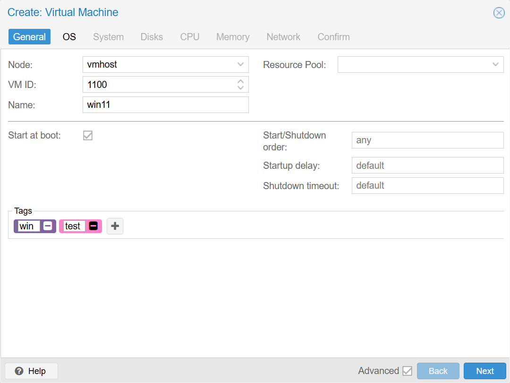
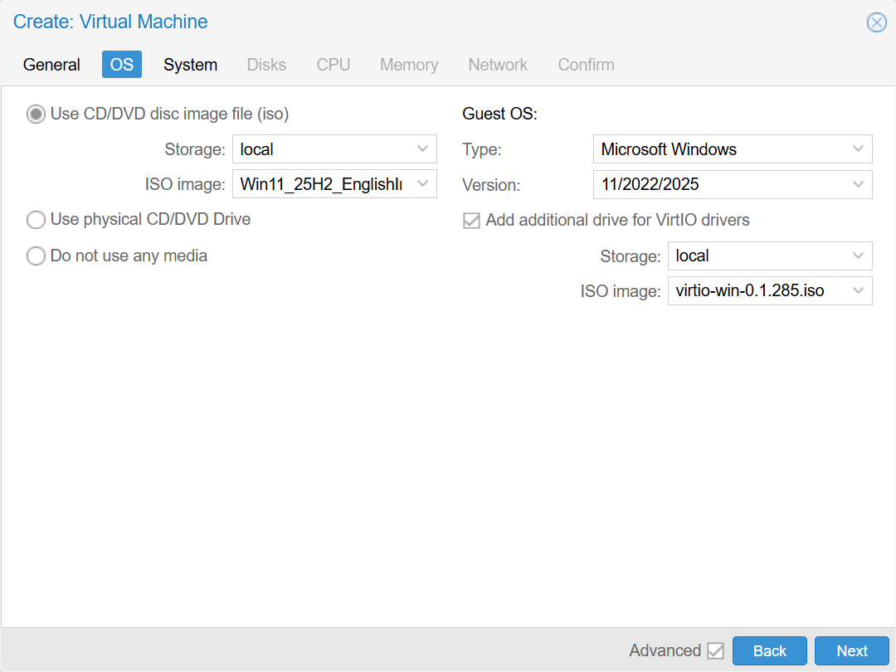
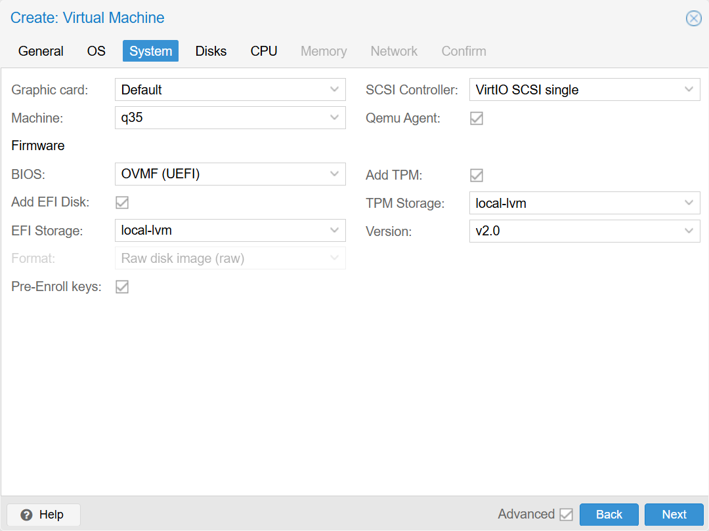
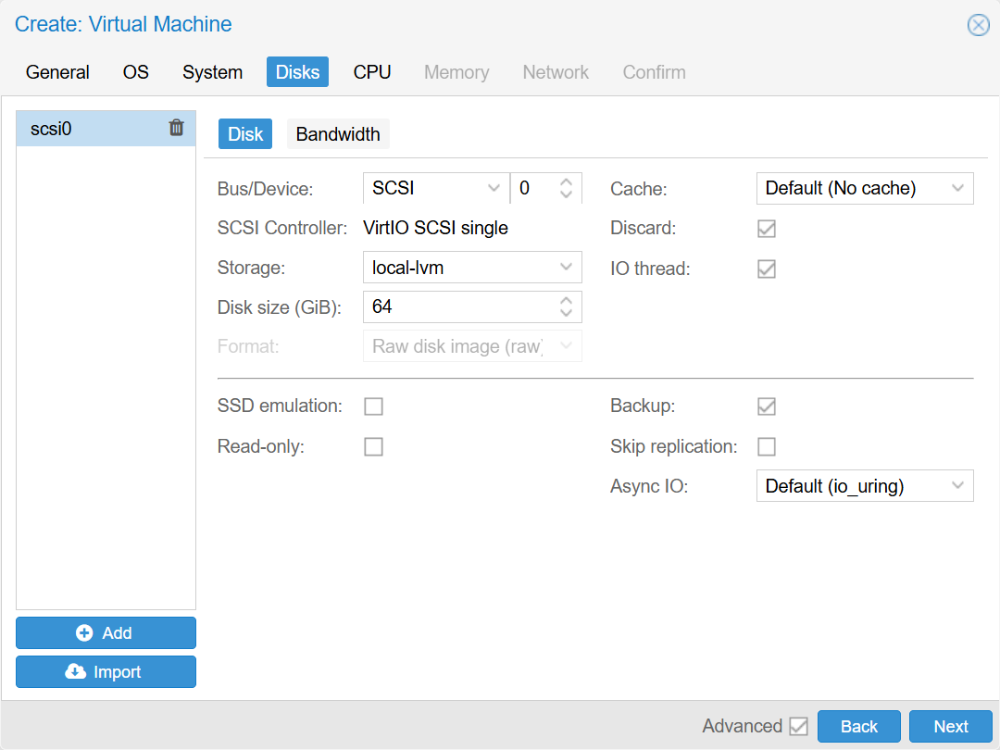
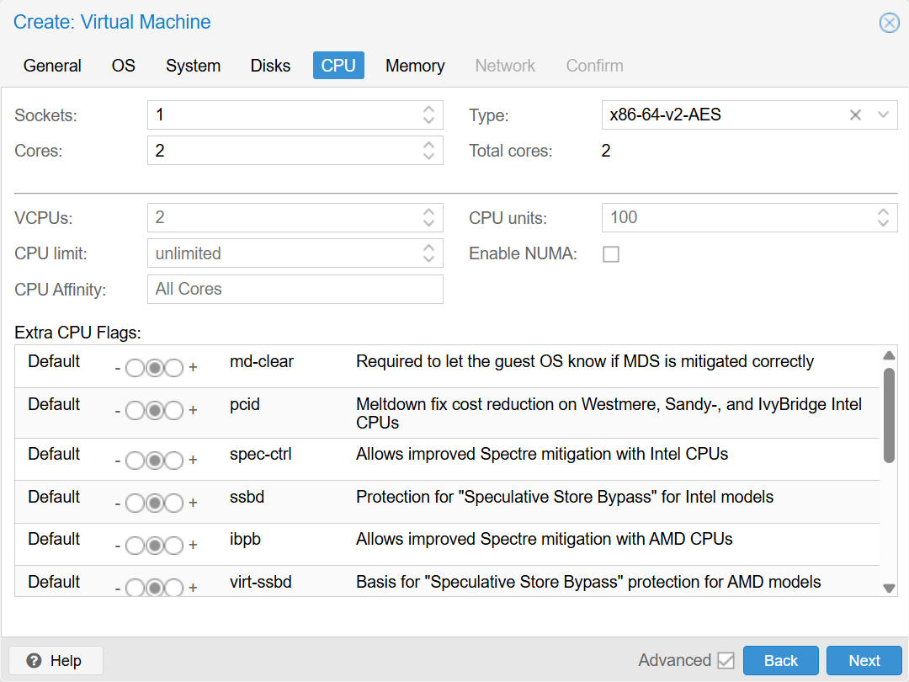
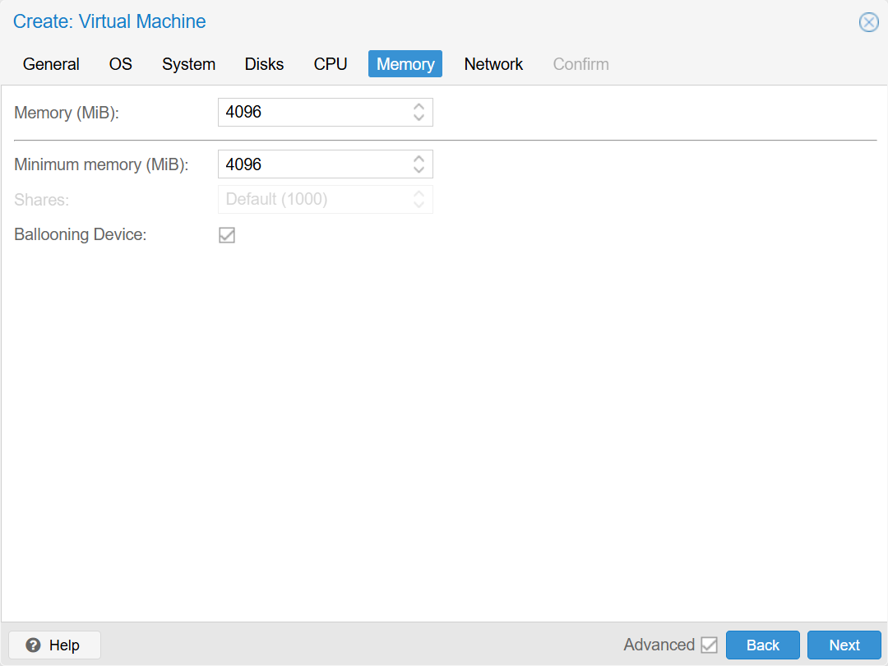

# Создание виртуальной машины Windows 11 в Proxmox VE 9

Описание пошагового процесса создания виртуальной машины с Windows 11 в Proxmox. Инструкция рассчитана на начинающих пользователей и охватывает базовые этапы - от подготовки установочного ISO-образа до настройки драйверов и гостевого агента. Затронуты вопросы требований Windows 11 (TPM 2.0, Secure Boot, и др.) и способы их обхода при необходимости.

## Подготовка

1. **ISO Windows 11**. Для создания виртуальной машины необходим образ самой Windows. К счастью доступен на сайте Microsoft без регистрации.
2. **VirtIO-драйверы**. Образ Windows не содержит встроенные драйвера для **VirtIO** устройств. Ссылка на скачивание образа с драйвераме есть на сайте с документацией Proxmox ([Windows VirtIO Drivers - Proxmox VE](https://pve.proxmox.com/wiki/Windows_VirtIO_Drivers)), в разделе **Installation**. Прямая ссылка - [virtio-win.iso](https://fedorapeople.org/groups/virt/virtio-win/direct-downloads/stable-virtio/virtio-win.iso).
3. **Подготовка ISO:** при необходимости можно использовать Rufus для отключения проверок TPM/Secure Boot при записи установочного ISO на флешку.

## Загрузка образов в Proxmox

1. В интерфейсе Proxmox откройте **Datacenter - ИмяСервера** - **Local** - **ISO Images** - **Upload**, выберите файл и нажмите Upload. Повторите операцию с образом virtio-win.iso.
2. После загрузки убедитесь, что оба файла отображаются в списке ISO Images.

## Создание новой виртуальной машины

Нажмите **Create VM** (вверху-справа).  
Откроется окно создания новой виртуальной машины. Для навигации по закладкам можно использовать команды Back, Next.
1. **General**, Первая закладка 
   1. **Node:** имя севрера. Сервер скорее всего один, заполнится автоматически.
   2. **VM ID:** уникальный идентификатор. Можно не менять.
   3. **Name:** имя - произвольное, например `Win11`.
   4. **Start at boot:** запускать виртуальную машину при старте сервера Proxmox. Я обычно включаю.
   5. **Tags:** если виртуальных машин много, то удобно отбирать их по тегам, например `win`, `ubuntu`, `prod`, `test`.  
   Остальные поля не трогаем.
   

   
Пример настроек General

   
      
   
   

   Next.

1. **OS**  
Мы загрузили образ в локальное хранилище, поэтому выбираем **Use CD/DVD disc image file (iso)**  
   1. **Storage:** local.
   2. **ISO image:** из списка нужно выбрать образ с Windows 11.
   3. **Type:** Microsoft Windows.
   4. **Version:** 11/2022/2025.
   5. **Add additional drive for VirtIO drivers:** ставим галку.
      1. **Storage:** local.
      2. **ISO image:** из списка нужно выбрать образ virtio-win.  
   

   
Пример настроек OS

   
      
   
   

   Next

1. **System**  
Меняем только следующие поля:
   1. **EFI Storage:** выбираем из списка local-lvm.
   2. **Qemu Agent:** включаем.
   3. **TPM Storage:** выбираем из списка local-lvm.
   

   
Пример настроек System

   
      
   
   

   Next

1. **Disks:**  
   1. **Disk size (GiB):** в системных требованиях Windows 11 указано минимум 64 GB. Указывайте размер в зависимости от сценария использования.
   2. **Cache:** `Default (No cache)` безопасно но медленнее, `Write back` быстрее но при потере питания данные могут быьт потеряны. Выбирайте в зависимости от потребности.
   3. **Discard:** включить, на хосте не будет резервироваться весь объем выделенного пространства.  
   Остальные поля не меняем.
   

   
Пример настроек Disks

   
      
   
   

   Next

2. **CPU:** 
   1. **Cores:** Минимум 2 ядра.  
Остальное не меняем.  
   

   
Пример настроек CPU

   
      
   
   

   Next

1. **Memory:**
    1. **Memory (MiB):** минимум 4096.  
   

   
Пример настроек Memory

   
      
   
   

   Next

2.  **Network**  
Ничего не меняем.  
Nest
1.  **Confirm**  
Можно проверить список настроек и убедиться в корректности перед завершением работы с мастером.  
Нужно снять галку галочку `Start after created`.  
Finish

В списке виртуальных машин появилась новая запись с указанными при создании ID и именем.  
Теперь можно запускать виртуальную машину и приступать к установке операционной системы.

## Установка Windows 11

1. Выбираем нашу виртуальную машину в списке и справа жмем кнопку `Start` (или через контекстное меню кликнув правой клавишей мыши по виртуальной машине).
2. Переходим в  `>_ Console` и видим стандартный установщик Windows.
3. Процесс установки стандартный, выберите редакцию Windows (Pro).
4. На этапе выбора диска нужно нажать `Load driver` - `Browse` - раскрыть диск `virtio-win` - `vioscsi - w11 - amd64`.
5. После установки драйвера появится виртуальный диск, который можно сразу разметить.
6. Теперь нужно повторить процедуру для сетевого драйвера: `Load driver` - `Browse` - `virtio-win` - `NetKVM → w11 → amd64`.
7. И еще раз для Balloon-драйвера: `Load driver` - `Browse` - `virtio-win` - `Balloon → w11 → amd64`.
8. Дальнейший процесс установки самы стандартный и здесь не описывается.
9. Создание локальной учетной записи (чтобы обойти необходимость указывать учетную запись Microsoft)
   1. Отключить у виртуальной машины доступ к сети. `Hardware` - `Network Device` - `Edit` - установить галку `Disconnect`.
   2. Нажать `Shift-F10`, ввести команду `oobe\bypassnro` и нажать `Enter`.
   3. После завершения установки нужно обратно включить сетевой адаптер.

## Установка VirtIO Guest Tools и QEMU Guest Agent
Установка операционной системы завершена и для полного завершения нужно установить драйвера и гостевой агент.

1. В Windows откройте диск с `virtio-win.iso`.
2. Установите `virtio-win-gt-x64.msi` - это установит все драйверы.
3. Установите `qemu-ga-x86_64.msi` - гостевой агент.
4. Перезагрузите виртуальную машину.

После этого Proxmox начнет отображать IP-адрес и состояние агента во вкладке **Summary**.

## Заключение

Теперь виртуальная машина с Windows 11 готова к использованию.
