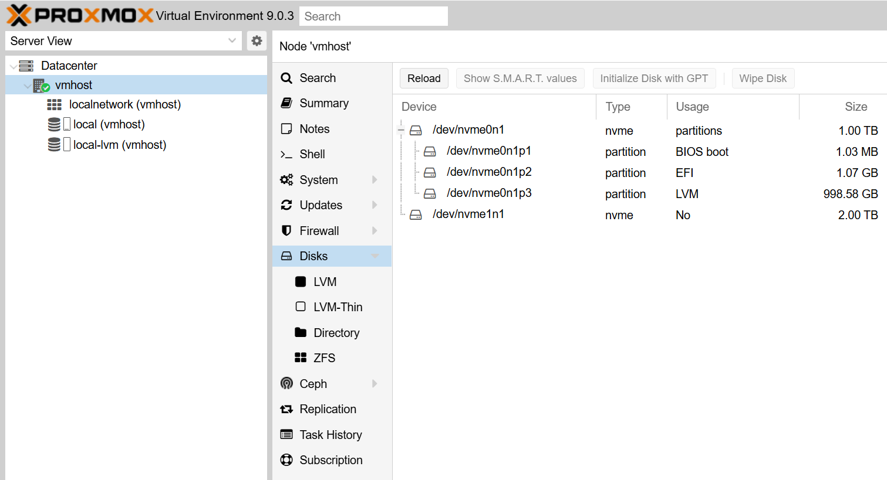

# Установка и базовая настройка Proxmox VE 9

**Proxmox Virtual Environment (VE) 9** - это платформа виртуализации на базе Debian. Данный гайд расчитан на начинающих пользователей, объясняет как установить и настроить Proxmox с нуля - от загрузки ISO-образа до запуска первой виртуальной машины. Инструкция опирается на официальную документацию и практики сообщества.

## Системные требования и подготовка оборудования

* **Процессор:** 64-битный CPU с поддержкой виртуализации Intel VT-x/AMD-V. Для аппаратного проброса (PCI Passthrough) потребуется поддержка VT-d/AMD-Vi на CPU и плате. В BIOS/UEFI убедитесь, что функции виртуализации включены (Intel VT, AMD-V).
* **Оперативная память:** Минимум **2 ГБ** RAM для самой Proxmox VE и базовых служб, плюс дополнительные ресурсы под каждую запущенную виртуальную машину. Рекомендуется **8 ГБ и более** для комфортной работы; при использовании ZFS или Ceph планируйте ~1 ГБ RAM на каждый 1 ТБ хранилища.
* **Накопитель:** Жесткий диск для установки системы. Минимально требуется **32 ГБ** свободного пространства для установки и базовых служб Proxmox VE; рекомендуется **60–120 ГБ** при размещении нескольких ВМ на том же диске. 
* **Сеть:** Один сетевой интерфейс минимум. 

**Подготовка:** В настройках UEFI/BIOS настройте приоритет загрузки с USB-накопителя. Если используются NVMe-SSD или специальные контроллеры, убедитесь в их совместимости с Linux (актуальное ядро Proxmox обычно поддерживает современное железо).

## Выбор файловой системы: ext4 или ZFS?

При установке Proxmox VE 9 можно выбрать файловую систему для корневого раздела: классическую **ext4** (или XFS) с LVM, либо современную **ZFS**. 

**Спойлер:** Выбираейте **EXT4**, если это **первое знакомство** с Proxmox и сервер не обладает большим объемом памяти. Система будет менее требовательна в обслуживании и ресурсах. Если же вы готовы инвестировать ресурсы  ради функциональности и обладаете необходимым навыками – **ZFS** ваш выбор, а эта инструкция - нет. 

**EXT4** (с **Logical Volume Manager**, **LVM):** Это вариант по умолчанию, оптимальный для новичков. Система устанавливается на ext4-раздел с LVM-томами: создаются тома для корня, подкачки и данных ВМ. Преимущества ext4: надежность и простота, низкие требования к памяти и ресурсам. Такой выбор подойдет, если у сервера **ограничена ОЗУ** (менее 8 ГБ), **один диск** и нет необходимости в продвинутых возможностях файловой системы. Ext4 + LVM - хороший выбор для начального развертывания и простых сценариев, где неважна тонкая настройка.

**ZFS:** Современная файловая система и менеджер томов, предоставляющая снапшоты, сжатие, контроль целостности и программный RAID из коробки. Proxmox VE поддерживает установку на ZFS-пул **rpool (root pool)**, причем можно выбрать уровни RAID (зеркало RAID1, RAIDZ и др.) прямо в установщике при наличии нескольких дисков.  **Однако** ZFS предъявляет повышенные требования к оборудованию: **не менее 8 ГБ ОЗУ** даже для однодисковых пулов, желательно **ECC-память** (чтобы предотвратить повреждение данных в памяти), а также более высокую нагрузку на CPU. Но самое гнавное - может привести к снижению производительности, ускорению износа SSD и, в худшем случае, к потере или повреждению данных.

*(Также доступны варианты XFS и Btrfs. XFS близок к ext4 по характеристикам и также использует LVM, существенных преимуществ для новичка не дает. Btrfs в Proxmox 9 помечен как**технологический превью** и не рекомендуется для production.)*

## Загрузка ISO и подготовка установочного носителя

1. **Скачайте образ Proxmox VE.**

Перейдите на официальный сайт Proxmox VE и загрузите актуальный ISO-образ Proxmox VE 9.0 ([Downloads - Proxmox Virtual Environment](https://www.proxmox.com/en/downloads/proxmox-virtual-environment)).

3. **Подготовьте USB-флешку.**

Proxmox VE поставляется в виде **гибридного ISO** – его можно записать либо на DVD, либо на USB-накопитель. Мы будем использовать загрузочную USB-флешку (минимум 2 ГБ). Для записи образа будем использовать Rufus ([Rufus - Create bootable USB drives the easy way](https://rufus.ie/en/), есть portable версия). Запустите утилиту выберите флешку и файл ISO. После нажатия «Старт» появится предупреждение об использовании режима **DD** для записи, этот режим гарантирует корректную запись гибридного образа Proxmox. Соглашаемся и ждем завершения записи.

## Установка Proxmox VE 9

Вставляйте флешку в будущий сервер и включайте.

После успешной загрузки с установочного носителя вы увидите меню Proxmox VE с вариантами запуска установщика. Выберите **«Install Proxmox VE (Graphical)**. Далее по шагам:

1. **Примите лицензионное соглашение.**
2. **Выбор диска для установки.** 

Выберите диск, на который будет установлен Proxmox. По умолчанию предлагается файловая система ext4, не меняем (это ведь гайд для новичков). Если всетаки нужно выполнить тонкую настройку, то справа от диска есть кнопка Options. Для ext4/XFS используется LVM-разметка - установщик сам разделит диск и создаст Volume Group `pve` и тома (`root`, `data`, `swap`). Можно при необходимости ограничить размеры томов (параметры `maxroot`, `maxvz` и др. – подходят опытным пользователям).  После настройки нажмите **Next**.

3. **Региональные настройки.** 

Укажите **часовой пояс**, **локаль**  и **раскладку клавиатуры**. Как правило, Proxmox сам определяет эти параметры по региону - проверьте их и поправьте при необходимости. От выбранного региона зависит зеркало репозиториев для загрузки обновлений, поэтому важно указать правильно страну. Нажмите **Next** для продолжения.

4. **Пароль и почта администратора.** 

Задайте пароль для суперпользователя `root` (от 8 символов, рекомендуется сложный пароль с буквами, цифрами, спецсимволами). Подтвердите пароль во втором поле. Этот же пароль будет использоваться для доступа через веб-интерфейс. Укажите **email** администратора (не обязательно настоящий) - на него Proxmox будет отправлять системные уведомления (позже мы настроим уведомления через telegram).  **Next**.

5. **Сетевые настройки узла.** 

На этом шаге нужно настроить сетевой интерфейс управления. Установщик покажет список сетевых карт; активные (с наличием линка) отмечены зеленым кружком. Выберите интерфейс, который будет использован для доступа к веб-интерфейсу  (обычно `eno1` или `eth0`). Задайте **hostname** (имя хоста), если нужно. Здесь же можно указать IPv4-адрес (по-умолчанию будет указано адрес присвоенный роутером), маску (`/24`), шлюз (gateway) и DNS-сервер. *Пример:* IP: 192.168.1.10/24, Gateway: 192.168.1.1, DNS: 192.168.1.1. Лучше сделать этот адрес статичным в настройках роутера. **Next**.

6. **Подтверждение и установка.** 

Проеряем все настройки: диск, файловая система, часовой пояс, адрес и т.д. Если нужно изменить – нажмите **Previous** и исправьте. Внизу снимите галку Автоматически перезагрузить после завершения установка. Для начала установки жмите **Install.**  Процесс займет несколько минут  По окончании вы увидите приглашение перезагрузиться. **В**ыньте загрузочную флешку из порта, затем нажмите **Reboot.**

После перезагрузки загрузится Proxmox VE 9 – ядро Linux и минимальная консоль Debian. Если монитор подключен, вы увидите приглашение консоли (текстовый логин). С этого момента основное управление будет через веб-интерфейс, а локальная консоль используется для отладки или продвинутых задач.

## Первичная настройка после установки

1. **Подключение к веб-интерфейсу.** 

 Откройте браузер  и перейдите по URL, указному при установке: `https://<IP_адрес_сервера>:8006`. Например, `https://192.168.1.10:8006`. Используйте **https** и порт **8006**, иначе интерфейс будет недоступен. Браузер выдаст предупреждение о незаменимом сертификате (Proxmox использует самоподписанный SSL-сертификат) – подтвердите исключение, чтобы продолжить. Появится страница входа Proxmox VE. Введите **логин**: `root`, **пароль**: (который вы задали при установке), и убедитесь, что выбран **Realm: Linux PAM standard authentication** (локальная аутентификация). Нажмите **Login** – вы попадете в админ-консоль Proxmox. Если вход выполнен, установка прошла успешно.

2. **Проверка настроек системы.** 

Проверка сетевых настроек. **Datacenter - **ИмяСервера** - System - Network** и проверьте параметры. Если нужно изменить IP или шлюз, жмите Edit, и вносите необходимые изменения. После правок сети понадобится нажать **Apply Configuration.**

Проверка часового пояса. **Datacenter** - **ИмяСервера** **- System - Time** при необходимости установите корректный часовой пояс.

3. **Отключение коммерческого репозитория (Enterprise).** 

Proxmox VE поставляется с включенным репозиторием Enterprise, требующим платной подписки. Без подписки при попытке обновления будут ошибки 401 Unauthorized. Для отключения в панели слева выберите **Datacenter - ИмяСервера - Updates - Repositories**. В списке найдите строки с `Enterprise` репозиторием (URL на `enterprise.proxmox.com`). Поочередно выделите их и нажмите кнопку **Disable** наверху. Затем нажмите **Add** и добавьте репозиторий **No-Subscription**. Теперь система будет использовать публичный репозиторий обновлений.

После этого выполните обновление пакетов. В левой части поднимитесь на уровень выше, из **Repositories** в **Updates** , и нажмите Upgrade. Откроется окно консоли, жмите Y. Дождитесь завершения обновления, после чего окно с закройте окно с консолью.

## Добавление хранилища для VM/CT

Перед созданием виртуальных машин убедимся, что у нас корректно настроено хранилище и сеть, особенно если у сервера несколько дисков или сетевых интерфейсов:

### Хранилище Proxmox VE

По умолчанию после установки в разделе **Datacenter - Storage** вы увидите два хранилища:

* **local** – файловое хранилище (директория `/var/lib/vz`) на корневом диске. Используется для хранения ISO-образов, шаблонов контейнеров, резервных копий и т.п. В ext4-разметке `local` также содержит образы дисков ВМ (формат raw или qcow2). В случае ZFS, `local` обычно хранит только шаблоны/ISO, а сами диски VM хранятся в отдельном хранилище типа zfspool.
* **local-lvm** – LVM-thin том (обычно volume group `pve`, thin pool `data`) для хранения образов дисков VM и контейнеров при установке на ext4/XFS. Он отображается только если Proxmox установлен на LVM. Если вы выбрали ext4 по умолчанию, `local-lvm` содержит основное пространство для дисков ВМ.

Вы можете использовать эти хранилища сразу: например, загрузить ISO на `local` и создавать диски ВМ на `local-lvm`. Однако часто требуется **добавить дополнительный диск** или задействовать отдельный накопитель для виртуальных машин (например, второй SSD или RAID-массив).

### Добавление второго диска (локальное хранилище) 

Если в сервер установлены дополнительные неразмеченные диски, они будут видны в **Node - Disks**. 

1. Выберите нужный диск (например, `/dev/nvme1n1`) и нажмите **Initialize Disk with GPT** (инициализировать таблицу разделов). Это подготовит диск к использованию (все данные на нем будут уничтожены).

2. Теперь нужно добавить диск, для доступно несколько способов **LVM-Thin** и **Directory** (ZFS слишком сложно, а LVM-Thin предпочтительнее просто LVM):

* **LVM-Thin Storage:** Рекомендуемый вариант, близок к стандартному `local-lvm` и поддерживает снапшоты. Работает быстро, удобно для хранения дисков виртуальных машин.  
Создаем пул - **Node - Disks - LVM-Thin** и нажмите **Create Thinpool**. Выберите диск, укажите имя пула (например, `vmdata-thin`), **Create**.  

* **Directory Storage (директория):** Простото. Видно в файловой системе. Можно использовать для хранения ISO, шаблонов и контейнеров LXC.
Создаем пул - **Node - Disks - Directory** и нажмите **Create Directory**. Выберите диск, файловую систему (ext4 по умолчанию) и имя (например, `vmdata`). Если установить отметку Add Storage, диск будет добавден в **Datacenter - Storage**.

3. После настройки нового хранилища, при создании ВМ вы сможете выбирать его для размещения дисков. Директория будет отражаться, как допустим, `vmdata (dir)`, LVM-thin как `vmdata-thin (lvmthin)` и т.п.

### Сетевые хранилища

Proxmox VE поддерживает NAS/SAN и распределенное хранение (Ceph), но их настройка выходит за рамки данной инструкции. В веб-интерфейсе через **Add Storage** можно подключить, например, NFS-долю, указав сервер и путь – после чего VMs смогут хранить диски на NAS. Для начальной настройки достаточно локальных хранилищ.

## Сетевая конфигурация

Сеть Proxmox может работать из коробки без дополнительных настроек, но важно понимать принцип. При установке система создала **Linux bridge** `vmbr0`, к которому привязан ваш основной интерфейс (например, `eno1` или `enp0s1`) и на мост повешен IP-адрес управления. По сути, `vmbr0` действует как виртуальный коммутатор: сам хост Proxmox имеет IP на нем, и любые виртуальные машины, подключенные к `vmbr0`, окажутся в той же физической сети, как будто они включены в свитч вместе с узлом.

Для доступа ВМ к внешней сети **не нужно никакого NAT** – достаточно подключать сетевые карты ВМ к **Bridge** `vmbr0`. Такой подход (бриджинг) – основной и рекомендованный в Proxmox. Если у хоста одна сетевая карта, все ВМ будут использовать ее же через bridge, разделяя пропускную способность. Если карт несколько, вы можете создать дополнительные мосты (например, `vmbr1` на втором интерфейсе) и распределить нагрузку или отделить трафик. *Пример:* можно вынести Storage-трафик или репликацию кластера на отдельный интерфейс/мост.

### Проверка сети после установки

Зайдите в **Node - Network**. Вы должны увидеть запись **Linux Bridge vmbr0** с вашим IP, и в разделе **Ports** – ваш физический eth/enp. Также могут присутствовать `lo` (loopback) и, если не использовался DHCP, запись для физического интерфейса (в случае bridge она обычно без IP). Если нужно изменить IP адрес хоста отредактируйте `vmbr0` через **Edit**  – после чего *Apply*.

### Дополнительные настройки

Если вы подключаете Proxmox-хост к VLAN-сетям, можно либо определять VLAN-настройки на портах коммутатора, либо создавать интерфейсы VLAN на самом Proxmox. С помощью команды **Create - Linux VLAN** в Network можно добавлять VLAN-интерфейсы (например, `vmbr0.50` для VLAN 50). Они могут быть полезны, если хост должен сам иметь адреса в разных VLAN или если вы не хотите чтобы ВМ “знали” о тегах. Однако зачастую проще пробросить trunk в Proxmox и отмечать VLAN уже в настройках VMs (в панели настройки сетевого интерфейса ВМ есть поле VLAN Tag).

### Wi-Fi

Proxmox не поддерживает бриджинг Wi-Fi карт для ВМ из-за ограничений беспроводных протоколов. Если ваш сервер подключен по Wi-Fi, ВМ не смогут напрямую моститься. Решения – перейти на проводное соединение либо настроить NAT (через Linux iptables) для ВМ, что достаточно сложно. Рекомендуется использовать проводную сеть для Proxmox.

### Firewall

Встроенный фаервол Proxmox по умолчанию не активен. Вы можете его включить и настроить правила на уровне датацентра, узла и каждой ВМ. Помните, что при включении firewall **на уровне узла** нужно явно разрешить трафик до портов управления (8006, 22, 5900 и пр.) в **датацентр/узел** правилах, иначе вы можете отрезать себе доступ. Без опыта – держите firewall выкл. либо тщательно следуйте документации по PVE Firewall.

## Заключение

Proxmox VE 9 успешно установлен и выполнена базовая настройка системы. Теперь сервер готов к работе: вы можете создавать виртуальные машины и контейнеры, настроить резервное копирование (Backup) и даже объединять несколько узлов в кластер для повышения отказоустойчивости. Proxmox предоставляет удобный веб-интерфейс для управления всеми этими задачами. Не забывайте поддерживать систему обновленной и периодически проверять состояния хранилищ и журналов. 